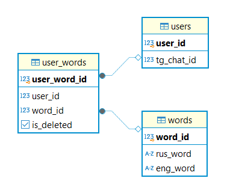

# Курсовая работа «ТГ-чат-бот «Обучалка английскому языку»» по курсу «Базы данных»

## Цель проекта - разработать базу данных Telegram-бота для изучения английского языка.

### В ходе создания проекта, была разработана база данных по схеме:

### Реализация базы данных, изображенной выше, приведена в файле database.sql

### Основной скрипт для запуска телеграм бота приведен в файле main.py
